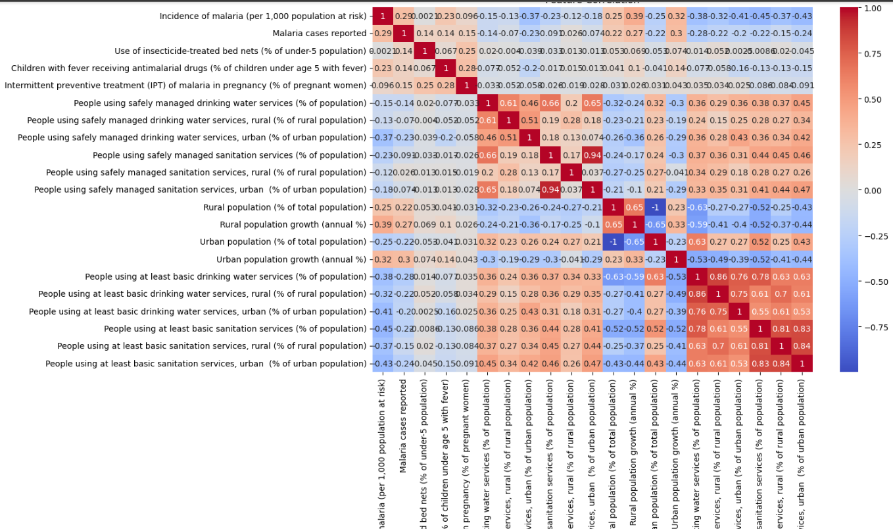
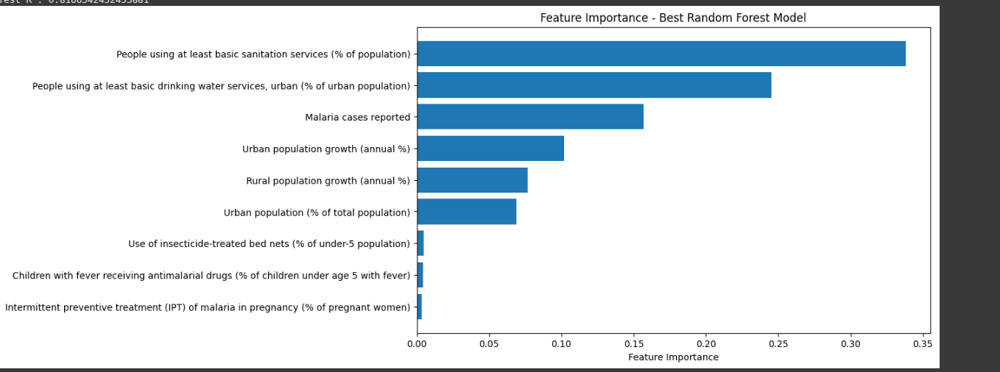

## What if you could use image detection to detect the severity of someones disease, at hospitals people stand in line for the service and you can only tell if they actually fall down with the human eye. This brings me to my mission reduce risks of dead by actually telling how someone is sick the moment he or she ask for a healthcare service through image detection 

## Source of The Dataset:

[Data source](https://www.kaggle.com/datasets/lydia70/malaria-in-africa)

**For this project, I developed a mobile app that leverages a Linear Regression model to predict the incidence of malaria (cases per 1000 people). The system analyzes key public health and demographic factors including bed net usage, antimalarial treatment rates, sanitation, urbanization, and water access to provide data-driven insights for malaria prevention.**

## Youtube Video Demonstration
[Watch the video]()


## Images of the some graphs from the model



## Try the Model Online (Hosted on Render)

🔗 [Access the API here](https://linear-regression-model-par3.onrender.com/docs)

> **Note:** The app may take 30–60 seconds to load upon first visit (the server wakes up from sleep), due to render free tier.

###  How to Use:
1. Visit the Swagger UI documentation:  
   [Access the API here](https://linear-regression-model-par3.onrender.com/docs)
2. Click on the **`/predict`** endpoint.
3. nput values for all the required public health and population fields:
      malaria_cases_reported, bed_net_use_pct, urban_pop_pct, etc.
5. Click "Try it out" to receive the predicted malaria incidence in the response.

## Run the Backend Locally

### Prerequisites:
- Python 3.13.9
- `pip` package manager

### Steps:
1. Clone the repository:
   ```bash
   https://github.com/Sng43/linear_regression_model.git
   cd linear_regression_model/summative/API

2. Create a virtual environment (recommended):
- python -m venv venv
- source venv/bin/activate  # On Windows: venv\Scripts\activate

3. Install dependencies:
- pip install -r requirements.txt

4. pip install -r requirements.txt
- uvicorn API.prediction:app --host 0.0.0.0 --port 10000

5. Open the interactive docs at:
http://localhost:10000/docs

## Run The Flutter Frontend Application

**Prerequisites:**
- Flutter SDK installed
- Android Studio / Xcode / or emulator configured
- Device or emulator running

## Steps:
1. Navigate into the summative folder:
cd linear_regression_model/summative/FlutterApp/malaria_predictor

2. Get flutter packages:
 flutter pub get

3. Run the app:
flutter run

## How to Use the App

1. **Enter the required input values:**
   - Malaria cases reported
   - Bed net use (%)
   - Fever treatment with antimalarials (%)
   - IPT coverage in pregnancy (%)
   - Urban population growth (%)
   - Rural population growth (%)
   - Urban population (% of total)
   - Basic sanitation access (%)
   - Urban drinking water access (%)

2. **Press the “Predict” button.**

3. **Wait** on the loading screen while the model processes the input.

4. **View the prediction** — the app will display the **predicted malaria incidence per 1000 people**.
